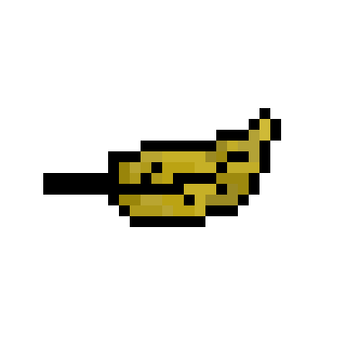

<div align="center">



# LEAFBREEZE

### Your hand is the controller. The leaf makes the rules.

[](https://community.infoeducatie.ro/)


**A webcam-controlled Simon Says game where computer vision turns real hand movement and finger poses into live gameplay.**

</div>

---

## The idea

LeafBreeze removes the keyboard from the game. A falling leaf moves toward a target while the player must place their hand in the correct horizontal zone and hold up the requested number of fingers.

The game uses $\color{#EF5A42}{\textsf{real-time hand tracking}}$ to turn the player's wrist position and finger poses into controls. Every instruction is $\color{#EF5A42}{\textsf{generated and spoken by AI}}$ — and the important word is still Simon. Follow the wrong command and the leaf wins.

## The first Open

LeafBreeze was my $\color{#EF5A42}{\textsf{first InfoEducație Open project}}$ and the beginning of a three-year run. It was a chaotic combination of computer vision, AI dialogue, text-to-speech and a pixel-art game, all built into one deeply questionable but surprisingly functional experiment.

## What it does

| | |
|---|---|
| $\color{#EF5A42}{\textsf{Sees the player}}$ | Tracks a hand through the webcam using MediaPipe landmarks. |
| $\color{#EF5A42}{\textsf{Counts gestures}}$ | Converts finger positions into poses from zero to five raised fingers. |
| $\color{#EF5A42}{\textsf{Maps motion to play}}$ | Uses the wrist position as a real-time horizontal controller. |
| $\color{#EF5A42}{\textsf{Generates challenges}}$ | AI chooses target positions, finger counts and short Simon Says prompts. |
| $\color{#EF5A42}{\textsf{Talks back}}$ | Google text-to-speech turns every generated instruction into audio. |
| $\color{#EF5A42}{\textsf{Keeps score}}$ | Streaks, lives, moving targets and deceptive prompts create the challenge. |

## The game loop

```text
listen → read the gesture → move your hand → match the pose → catch the leaf
```

- $\color{#EF5A42}{\textsf{OpenCV}}$ captures the webcam feed.
- $\color{#EF5A42}{\textsf{MediaPipe}}$ extracts the hand landmarks, wrist position and finger state.
- The AI creates a new $\color{#EF5A42}{\textsf{target and spoken instruction}}$.
- $\color{#EF5A42}{\textsf{Pygame}}$ renders the leaf, hand, target, menus, animation and sound.
- Correct catches build the streak; missed or false commands cost $\color{#EF5A42}{\textsf{lives}}$.

## Built with

| Layer | Technology |
|---|---|
| Game | $\color{#EF5A42}{\textsf{Python and Pygame}}$ |
| Vision | $\color{#EF5A42}{\textsf{OpenCV}}$ · MediaPipe Hands |
| Language | $\color{#EF5A42}{\textsf{OpenAI GPT-3.5 Turbo}}$ integration |
| Voice | $\color{#EF5A42}{\textsf{Google Text-to-Speech}}$ |
| Visuals | Custom $\color{#EF5A42}{\textsf{pixel-art interface}}$ and sprite system |
| Input | Webcam · keyboard · optional controller support |

## Run it

### 1. Check the requirements

- $\color{#EF5A42}{\textsf{Python 3.10 or newer}}$
- A working $\color{#EF5A42}{\textsf{webcam}}$
- An OpenAI API key for the legacy AI integration

### 2. Install the dependencies

```bash
pip install pygame opencv-python mediapipe openai==0.28.1 gTTS
```

### 3. Start the game

Set `API_KEY` inside `leafbreeze/Components/Constants/constants.py`, then launch the game from Python:

```python
from leafbreeze import LeafBreeze

game = LeafBreeze()
while game.RUNNING():
    game.update()
```

*LeafBreeze is an archived competition prototype built against legacy AI and vision dependencies. Never commit a real API key.*

## License

The original source code is released under the [MIT License](LICENSE.txt). Any externally sourced dependencies, music or other assets remain subject to their respective authors' terms.

---

## Three years at Open

<div align="center">

| 2024 | 2025 | 2026 |
|:---:|:---:|:---:|
| $\color{#EF5A42}{\textsf{LeafBreeze}}$ | **Found and Loading** | **Cognify** |
| Computer vision game | Mobile AR game | Agentic browser harness |

Built during $\color{#EF5A42}{\textsf{InfoEducație Open 2024}}$ by [Adrian Contraș](https://github.com/adisimaimulte1).

</div>
